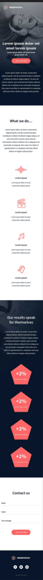
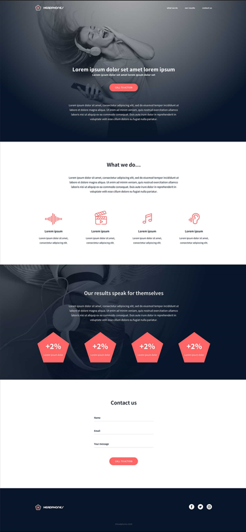

# Holberton Headphones

*Implement a design from scratch*

## Description
This project implements a design from scratch using plain HTML/CSS. It is meant to duplicate the visual design of a fully functioning website.

The project does not have any restrictions, other than:
* No outside CSS frameworks (ex. Bootstrap)
* No Javascript

##### You can find the Figma file [here.](https://www.figma.com/file/gkWRcFqkwtruWZgSfnnHF0/Holberton-School---Headphone-company?node-id=0%3A1)

## Project Advice
* Start with these strong foundations:
	-   reset CSS styling
	-   use variables
	-   simple/“as generic as you can” CSS selectors
	-   avoid using super specific CSS selectors as much as possible
	-   simple HTML structure -  `div`  containers are your friend!
* Start from outside-in. Otherwise, it's easy to get lost in the HTML tags.

## Features
* Fully functioning website that takes into account accessibility and responsive design.
* Website is running on plain HTML/CSS, so no need to run any packages, just run a local server! (easily done with VS Code extensions)
* Design created from mobile view first, then desktop implemented.
* Did I mention it's made from scratch? 😱😱😱
## Download and try yourself
### 1. Clone the Repo
* Run the following command to clone the repository:
```
git clone https://github.com/Lyndonpett/holberton-headphones
```
### 2. Open the HTML
* Choose an HTML file to the corresponding task. Final design will be in 101-index.html. In Visual Studio Code, use the ***"[Live Server](https://marketplace.visualstudio.com/items?itemName=ritwickdey.LiveServer)"*** extension and the webpage will be open in your browser.

* If not using Visual Studio Code, choose whichever development local server you want to use. Then choose the HTML file you want to open.

### 3. View in Browser
* After the following steps, you should now be able to see the corresponding webpage open in your browser!

## Examples

* Overview


* Mobile


* Desktop

